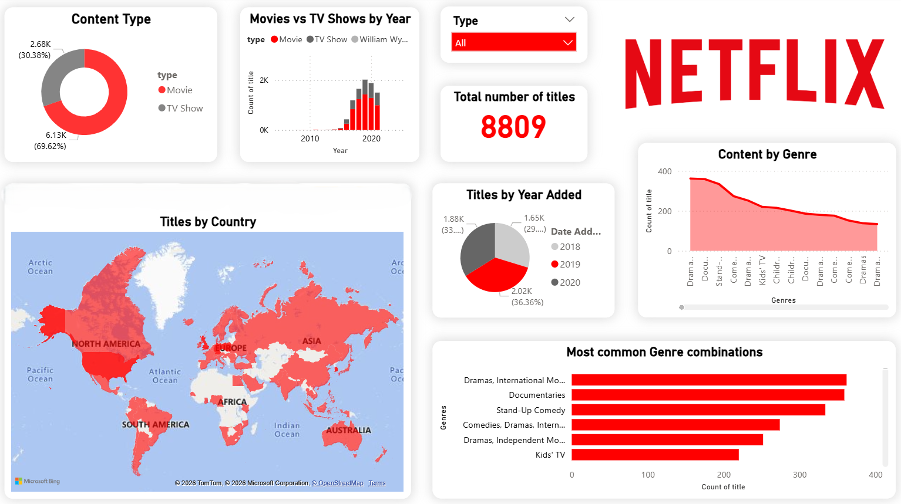

# Netflix-Data-Analysis-Power-BI
Power BI dashboard analyzing Netflix Movies and TV Shows based on country, genre, and time trends.

# Dashboard Preview

---

# Netflix Movies & TV Show Data Analysis – Power BI Project

## Project Overview

This Power BI dashboard explores and analyzes Netflix’s global content library. The project is based on the publicly available **Netflix titles dataset**, and covers insights on:

- Content distribution by **country**, **type**, and **genre**
- Trends in **titles added over the years**
- Most common **directors** and **genre combinations**
- Release vs added date pattern for Netflix content

This project helps understand content trends for viewers, analysts, and streaming strategists.

---

## Tools Used

| Tool        | Purpose                                 |
|-------------|------------------------------------------|
| **Power BI**| Dashboard building and data visualization |
| **Excel**   | Initial data cleaning and prep            |

---

## Dashboard Highlights

- Total Titles: **8809**
- Type Split: **TV Shows vs Movies**
- Top Producing Countries: **US, India, UK, Japan**
- Most Common Genres: *Dramas, Documentaries, Comedy*
- Content Growth: Spike after 2016, peaking around 2020–2021
- Top Directors: *Rajiv Chilaka*, *Raúl Campos*, etc.

---

Dataset source link: https://www.kaggle.com/datasets/shivamb/netflix-shows
 
